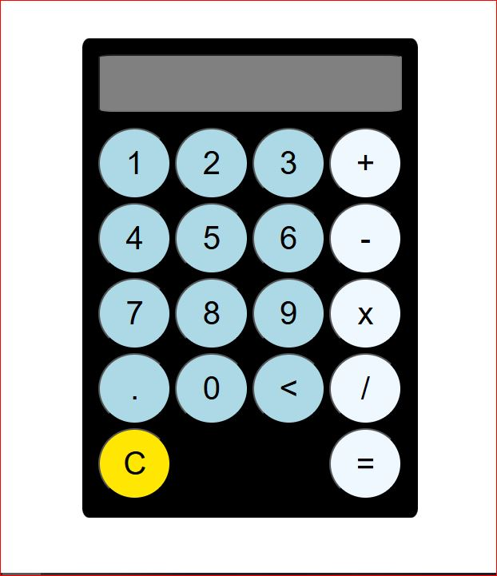

# JavaScript Калькулятор

Учебный калькулятор с базовыми арифметическими операциями.  
Реализован на чистом JavaScript с безопасным вычислением выражений через библиотеку `expr-eval`.  

**Фичи:**  
- Ввод через UI-кнопки с контролем корректности  
- Поддержка операторов, скобок и десятичных чисел  
- Очистка и удаление символов  
- Валидация и защита от некорректного ввода  

Код чистый, структурированный, готов к расширению.  
Идеально для демонстрации навыков работы с DOM и безопасным вычислением.

## Demo
[Посмотреть рабочий демо-сайт](https://silver-dieffenbachia-769943.netlify.app/)

*Учебный проект, не для продакшена.*
